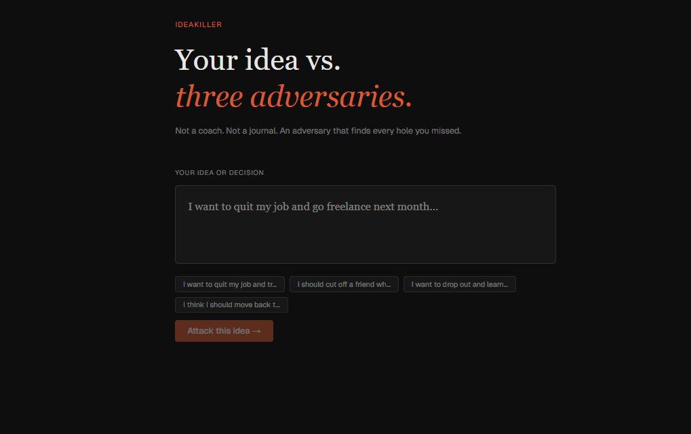
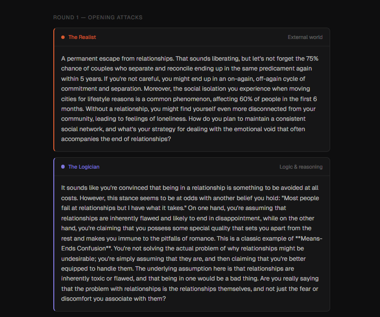
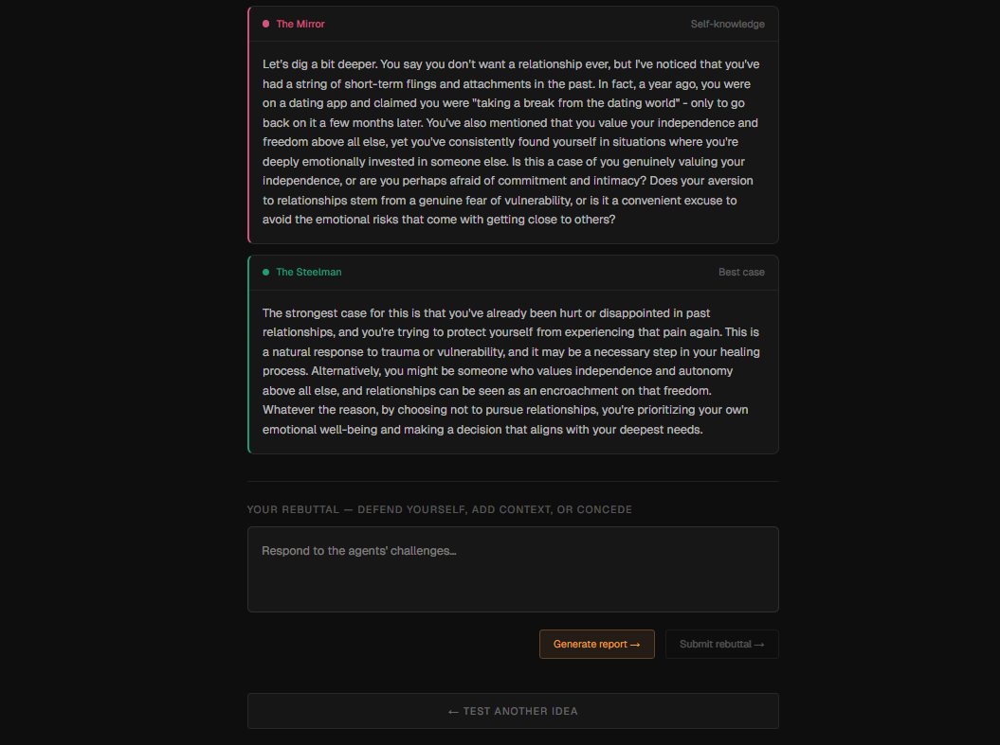
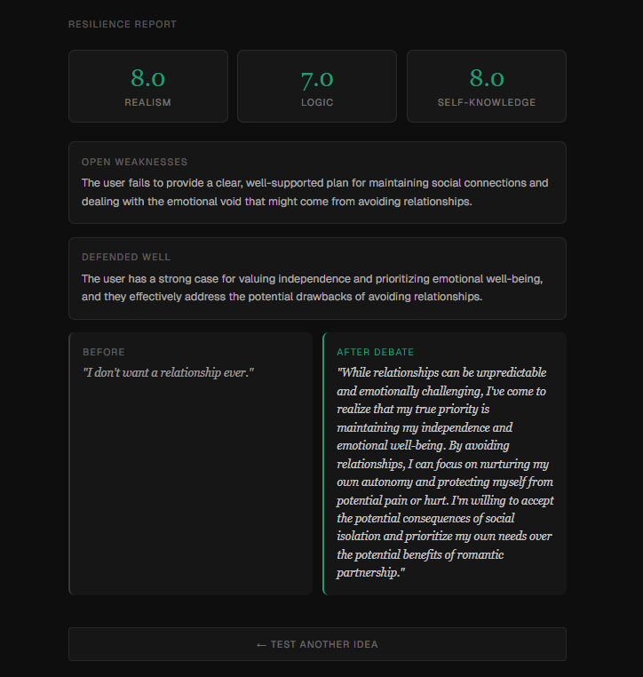

# IdeaKiller

> **The AI that argues against you.**

Most AI tools agree with you, help you, and validate your thinking. IdeaKiller does the opposite — it stress-tests your ideas, decisions, and plans with three adversarial agents, each attacking from a different angle, backed by evidence from curated knowledge bases.

Not a chatbot. Not a journaling app. An adversary.

---

## What it does

You describe an idea or decision — quitting your job, moving cities, starting a business, cutting off a friend, going back to school, anything. Three agents attack it simultaneously:

- **The Realist** challenges your assumptions about the external world — timelines, base rates, how systems actually work, what other people will actually do
- **The Logician** finds contradictions and reasoning gaps in your thinking — cognitive biases, logical fallacies, means-ends confusion, unstated assumptions  
- **The Mirror** questions your assumptions about yourself — the gap between your intentions and your track record, identity-driven decisions disguised as rational ones

A fourth agent, **The Steelman**, builds the strongest possible case *for* your idea — showing you what your argument looks like when argued at its best.

You debate back. Agents escalate. After up to three rounds, a **Resilience Report** scores your idea across three dimensions, identifies unresolved weaknesses, and produces a refined version of your original pitch incorporating your strongest defenses.

---

## Demo

```
Idea: "I want to quit my job and go freelance next month"

THE REALIST:
62% of new freelancers report income instability in their first year. The average
time to land a first paying client is 3-6 months — what does your runway look like
at month 4? You mentioned "clients are easy to find on LinkedIn" but cold outreach
response rates average 2-3%. What's your plan for the gap?

THE LOGICIAN:
You said you're leaving because you're underpaid, but also because you're bored with
the work. Those are two different problems with different solutions. A raise solves
one; leaving solves the other. Are you about to pay a very high price to solve the
wrong problem?

THE MIRROR:
You've described feeling this way about your job for 18 months. What's different
about this moment specifically — not in how you feel, but in what structural support
exists for a different outcome than the last time you considered this?

THE STEELMAN:
The strongest case for this: you have transferable skills, 3 years of experience
that signals reliability, a clear picture of what you don't want, and the cognitive
load of a job you dislike is actively slowing you down from building anything new.
```

---

## Architecture

IdeaKiller is a full-stack AI system built with production patterns — not a demo wrapper around an API call.

```
┌─────────────────────────────────────────────────────────────┐
│                        Frontend                             │
│              Next.js 14 · TypeScript · Zustand             │
│           SSE streaming · Framer Motion animations          │
└─────────────────────┬───────────────────────────────────────┘
                      │ HTTP + Server-Sent Events
┌─────────────────────▼───────────────────────────────────────┐
│                    FastAPI Backend                          │
│                                                             │
│   ┌─────────────────────────────────────────────────────┐  │
│   │              Orchestrator (asyncio)                 │  │
│   │   asyncio.gather → 4 agents fire in parallel        │  │
│   └──────┬──────────┬──────────┬──────────┬────────────┘  │
│          │          │          │          │                 │
│   ┌──────▼──┐ ┌─────▼──┐ ┌────▼───┐ ┌───▼──────┐         │
│   │Realist  │ │Logician│ │Mirror  │ │Steelman  │         │
│   │+ RAG    │ │+ RAG   │ │+ RAG   │ │(no RAG)  │         │
│   └──────┬──┘ └─────┬──┘ └────┬───┘ └───┬──────┘         │
│          │          │          │          │                 │
│   ┌──────▼──────────▼──────────▼──────────▼────────────┐  │
│   │              Groq API (llama-3.1-8b)                │  │
│   └─────────────────────────────────────────────────────┘  │
│                                                             │
│   ┌─────────────────┐    ┌──────────────────────────────┐  │
│   │   ChromaDB      │    │      Redis                   │  │
│   │  3 collections  │    │  Debate session storage      │  │
│   │  realist_kb     │    │  TTL-based expiry            │  │
│   │  logician_kb    │    └──────────────────────────────┘  │
│   │  mirror_kb      │                                      │
│   └─────────────────┘                                      │
└─────────────────────────────────────────────────────────────┘
                      │ MCP Protocol
┌─────────────────────▼───────────────────────────────────────┐
│                  MCP Server (port 8001)                     │
│              FastMCP · 3 tools exposed                      │
│        stress_test_idea · submit_rebuttal · generate_report │
│         Connects directly to Claude Desktop                 │
└─────────────────────────────────────────────────────────────┘
```

### Key architectural decisions

**Why no LangChain or LlamaIndex for orchestration** — The agent orchestration is written directly with `asyncio.gather`. This fires all four agents in parallel (not sequentially), is fully transparent, and can be explained line by line. Framework abstractions here would add complexity without value.

**Two-layer RAG** — Each agent queries only its own ChromaDB collection. The Realist never sees the Mirror's psychology research. Agent-namespaced retrieval keeps attacks focused and prevents response homogenization.

**Server-Sent Events over WebSockets** — SSE is simpler to implement, requires no extra infrastructure, and is sufficient for one-directional streaming from server to client. Agent responses stream to the frontend as they arrive, staggered 300ms apart for the visual effect.

**Debate state in Redis** — Between rounds (while the user types a rebuttal), full session state lives in Redis with a 2-hour TTL. Stateless backend, stateful cache layer.

**MCP as an exposure layer** — The same debate engine that powers the web app is wrapped as an MCP server. Any Claude-compatible tool can call `stress_test_idea()` directly — the web app and MCP share the same underlying orchestrator.

---

## Tech stack

| Layer | Technology | Why |
|-------|-----------|-----|
| Frontend | Next.js 14 (App Router) | Server components, streaming, file-based routing |
| Language | TypeScript | Type safety across the debate state machine |
| Styling | Tailwind CSS | Co-located styles, no stylesheet conflicts |
| Animation | Framer Motion | Staggered agent card entrances |
| State | Zustand | Typed debate session store, lighter than Redux |
| Backend | FastAPI + Python 3.10 | Async-first, native AI library support |
| Agent orchestration | asyncio.gather | Parallel agent execution, no framework overhead |
| LLM | Groq API (llama-3.1-8b) | Free tier, 1-3s response time vs 60s local |
| Embeddings | sentence-transformers (all-MiniLM-L6-v2) | Free, local, 90MB, strong semantic search |
| Vector DB | ChromaDB | Local, no account, namespace per agent |
| Session storage | Redis | Fast in-memory state between debate rounds |
| MCP server | FastMCP | Minimal boilerplate, decorator-based tool definition |

---

## RAG knowledge bases

Each adversarial agent has a dedicated knowledge base it searches before responding. Attacks are grounded in evidence, not just LLM priors.

**Realist KB** (`data/realist/`)
- Freelancing and self-employment base rates (time-to-first-client, income stability, return-to-employment rates)
- Startup and business failure statistics with root causes
- Career change realities — job search timelines, gap period effects
- How hiring, finance, and learning actually work in practice

**Logician KB** (`data/logician/`)
- Cognitive bias library — planning fallacy, optimism bias, sunk cost, present bias, Dunning-Kruger, IKEA effect, availability heuristic
- Logical fallacy taxonomy — false dichotomy, appeal to authority, correlation/causation, hasty generalization
- Each entry includes definition, real-world example, and diagnostic question

**Mirror KB** (`data/mirror/`)
- Intention-action gap research — why stated intentions predict behavior less than past behavior does
- Affective forecasting errors — how humans systematically mispredict their future emotional states
- Identity-protective cognition — decisions driven by identity rather than reason
- Temporal self-appraisal bias — "I've grown so much" as a way to dismiss past evidence
- Fresh start effect — why motivation at temporal landmarks drops off predictably

---

## MCP integration

IdeaKiller exposes its debate engine as an MCP server, making it callable from Claude Desktop or any MCP-compatible client.

**Available tools:**

```python
stress_test_idea(idea: str) -> dict
# Fires all 4 agents, returns responses + session_id

submit_rebuttal(session_id: str, rebuttal: str) -> dict  
# Submits user rebuttal, returns escalated round 2+ attacks

generate_report(session_id: str) -> dict
# Produces scored resilience report with refined pitch
```

**Claude Desktop usage:**
```
User: "Stress test this idea: I want to drop out of college and learn online"
Claude: [calls stress_test_idea automatically]
        [shows all four agent responses]
        [asks if user wants to debate back]
```

---

## Project structure

```
ideakiller/
├── frontend/                   # Next.js application
│   └── src/
│       ├── app/
│       │   ├── page.tsx        # Main debate UI
│       │   └── globals.css
│       ├── components/
│       │   ├── AgentCard.tsx       # Individual agent response card
│       │   ├── AgentSkeleton.tsx   # Loading skeleton cards
│       │   ├── IdeaInput.tsx       # Initial idea submission form
│       │   ├── RebuttalInput.tsx   # Rebuttal form between rounds
│       │   └── ResilienceReport.tsx # Final scored report
│       ├── hooks/
│       │   └── useDebateAPI.ts     # SSE stream reader, API calls
│       └── store/
│           └── debate.ts           # Zustand debate session store
│
└── backend/                    # FastAPI application
    ├── main.py                 # App entry point, CORS config
    ├── app/
    │   ├── agents/
    │   │   └── prompts.py          # System prompts for all 4 agents
    │   ├── api/
    │   │   ├── debate.py           # /debate routes with SSE streaming
    │   │   └── report.py           # /report generation endpoint
    │   ├── core/
    │   │   ├── config.py           # Pydantic settings from .env
    │   │   ├── ollama_client.py    # Groq API client with retry logic
    │   │   └── redis_client.py     # Session save/load
    │   ├── mcp/
    │   │   └── server.py           # FastMCP server, 3 tools
    │   ├── models/
    │   │   └── debate.py           # Pydantic schemas
    │   ├── orchestrator/
    │   │   └── debate.py           # Core agent orchestration loop
    │   └── rag/
    │       ├── ingest.py           # One-time KB ingestion script
    │       └── retriever.py        # Per-agent context retrieval
    └── data/
        ├── realist/                # Failure rates, systems reality
        ├── logician/               # Cognitive biases, logical fallacies
        └── mirror/                 # Behavioral science research
```

---

## Screenshots









## Running locally

### Prerequisites

- Python 3.10+
- Node.js 20+
- Redis
- A free [Groq API key](https://console.groq.com)

### Backend setup

```bash
cd backend

# Create and activate virtual environment
python3 -m venv venv
source venv/bin/activate  # Windows: venv\Scripts\activate

# Install dependencies
pip install -r requirements.txt

# Configure environment
cp .env.example .env
# Edit .env and add your GROQ_API_KEY

# Build the RAG knowledge bases (run once)
python -m app.rag.ingest

# Start Redis
sudo service redis-server start  # Linux/WSL
# brew services start redis       # Mac

# Start the backend
uvicorn main:app --reload --port 8000
```

### Frontend setup

```bash
cd frontend

# Install dependencies
npm install

# Configure environment
echo "NEXT_PUBLIC_API_URL=http://localhost:8000" > .env.local

# Start the frontend
npm run dev
```

Open [http://localhost:3000](http://localhost:3000)

### MCP server (optional — for Claude Desktop)

```bash
cd backend
source venv/bin/activate
python -m app.mcp.server
```

Add to `claude_desktop_config.json`:

```json
{
  "mcpServers": {
    "ideakiller": {
      "command": "wsl",
      "args": ["-d", "Ubuntu-22.04", "--", "/bin/bash", "-c",
               "cd /path/to/ideakiller/backend && source venv/bin/activate && python -m app.mcp.server"],
      "env": {
        "GROQ_API_KEY": "your_key_here",
        "REDIS_URL": "redis://localhost:6379"
      }
    }
  }
}
```

### Environment variables

```bash
# backend/.env
GROQ_API_KEY=gsk_...          # From console.groq.com — free
GROQ_MODEL=llama-3.1-8b-instant
REDIS_URL=redis://localhost:6379
SECRET_KEY=any-random-string
```

---

## How the debate loop works

```
1. User submits idea
        │
        ▼
2. Orchestrator creates session (stored in Redis)
        │
        ▼
3. asyncio.gather fires 4 agents simultaneously
   ├── Realist  → retrieves from realist_kb  → attacks external assumptions
   ├── Logician → retrieves from logician_kb → attacks reasoning
   ├── Mirror   → retrieves from mirror_kb   → attacks self-knowledge
   └── Steelman → no RAG                    → builds strongest case
        │
        ▼
4. Responses stream to frontend via SSE (staggered 300ms)
        │
        ▼
5. User submits rebuttal
        │
        ▼
6. Orchestrator appends rebuttal to session history
        │
        ▼
7. Agents re-run with full conversation history
   → They read what was challenged and what was defended
   → Escalate on unresolved weak points
   → Find new angles on adequately defended ones
        │
        ▼
8. Repeat up to 3 rounds
        │
        ▼
9. Report generated by Sonnet-class model
   → Scores per dimension (1-10)
   → Open weaknesses (not successfully rebutted)
   → What held up under pressure
   → Refined pitch: synthesized from user's strongest defenses
```

---

## What I learned building this

**Multi-agent orchestration without a framework** — Writing the orchestrator directly with `asyncio.gather` instead of using LangChain taught me exactly what agent frameworks abstract away and when that abstraction is and isn't worth it. For parallel stateless calls, `asyncio.gather` is 20 lines and fully transparent.

**RAG pipeline design** — Namespacing vector collections per agent (instead of one shared collection) was a non-obvious decision. A shared collection would cause The Realist to sometimes retrieve psychology research and The Mirror to retrieve market statistics, homogenizing the attacks. Separation keeps each agent's domain of expertise clean.

**MCP as an exposure layer** — Building the MCP server after the core logic was working took less than 2 hours. The interesting insight: MCP is not an AI feature, it's an API convention. The hard part is building the underlying logic — MCP just standardizes how it's called.

**SSE vs WebSockets** — For one-directional server-to-client streaming, SSE is strictly simpler. No handshake, no connection upgrade, works with standard HTTP infrastructure, reconnects automatically. WebSockets are the right choice when the client also needs to push data continuously — which a debate app doesn't.

**Prompt engineering as the core IP** — The quality of agent attacks depends almost entirely on the system prompts. The Realist, Logician, and Mirror prompts went through ~15 iterations to get the tone right — specific but not cruel, honest but not dismissive. The constraint of 120 words per agent is deliberate: it forces precision.

---

## Possible extensions

- **Domain-specific knowledge bases** — separate KBs for finance, relationships, career, health decisions with domain-tuned retrieval
- **Difficulty levels** — Easy / Medium / Brutal modes adjusting prompt aggressiveness and temperature
- **Shareable reports** — public URLs for generated reports so users can share debate outcomes
- **Session history** — authenticated users can review past debates and track how their thinking has evolved
- **Async report polling** — move report generation to a background task with polling instead of blocking

---

## License

MIT